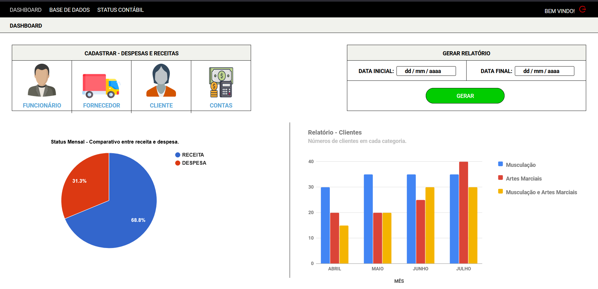

<h3 align="center">
    
</h3>

<h3 align="center">Olímpia Academia</h3>

<div align="center">
  <a href="https://www.linkedin.com/in/vinicius-piantoni-328339186">
    
  </a>
    
  <a href="https://github.com/ViniPiantoni/engreplus-public/blob/master/LICENSE">
    
  </a>
</div>

---

### 📺 Apresentação:

Esse projeto foi elaborado com o intuito de criar um sistema automatizado que permite realizar a contabilização das despesas financeiras para a Academia Olimpia. A criação desta plataforma tem como foco principal a otimização de processos e economiza na gestão de tempo para atividades contábeis, diminuir os riscos de possíveis erros de contabilização e armazenar importantes informações em um banco de dados.

<h3 align="center">
    
</h3>

---

### 💻 Tecnologias utilizadas
- [Node](https://nodejs.org/en/)
- [ReactJS](https://pt-br.reactjs.org/)
- [HTML](https://developer.mozilla.org/pt-BR/docs/Web/HTML)
- [CSS](https://developer.mozilla.org/pt-BR/docs/Web/CSS)

---

 ### 🔥 Instalação e inicialização

 #### Pré-requisitos

 - É <strong>necessário</strong> ter instalado o [Node](https://nodejs.org/en/) qualquer versão <strong>acima de 10</strong>.
- Instalar o [NPM](https://www.npmjs.com/get-npm) ou [YARN](https://classic.yarnpkg.com/pt-BR/docs/install/) (recomendamos o NPM).

##### 1º :page_facing_up: Clone no repositório:

```sh
    $ git clone https://github.com/ViniPiantoni/PI-AcademiaOlimpia.git
```

##### 2º :fast_forward: Instale as dependências usando NPM ou YARN e execute a aplicação:

- Iniciando a aplicação web

```sh
    # Pelo prompt de comando entre na pasta web
    $ cd code/web

    # Instale as dependências
    $ npm install

    # Inicie a aplicação
    $ npm start

    # Automáticamente será aberta uma janela no seu navegador padrão.
    # Caso isso não ocorra acesse: localhost:3000.
```

---

### :raised_hand: Dependências

#### Web

- axios
- jsonwebtoken
- react
- react-dom
- react-icons
- react-input-mask
- react-router-dom
- react-google-charts
- react-scripts

---

### 🔒 Licença

Esse projeto está sob a licença MIT. Veja o arquivo [LICENSE](LICENSE) para mais detalhes.

---

Feito com ❤️ by [Vinicius Piantoni](https://www.linkedin.com/in/vinicius-piantoni-328339186).